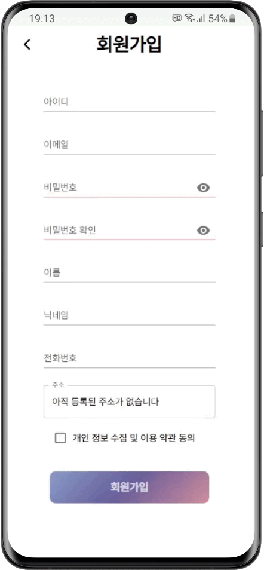
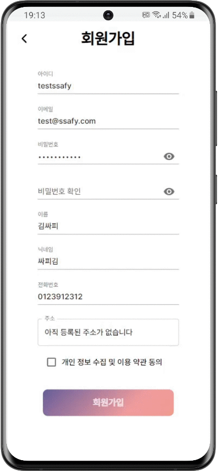
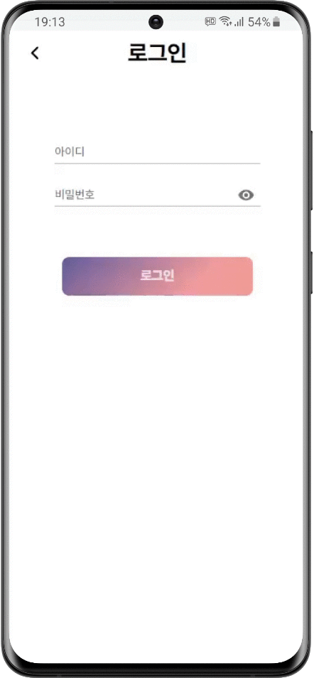
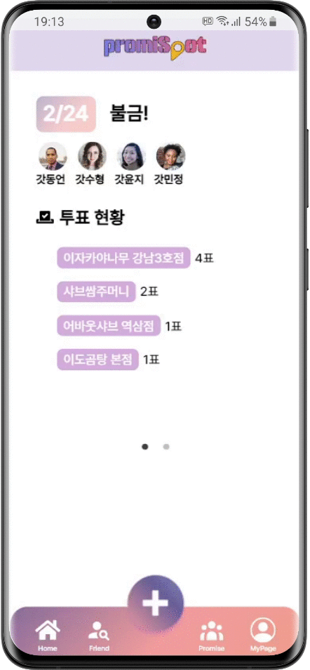
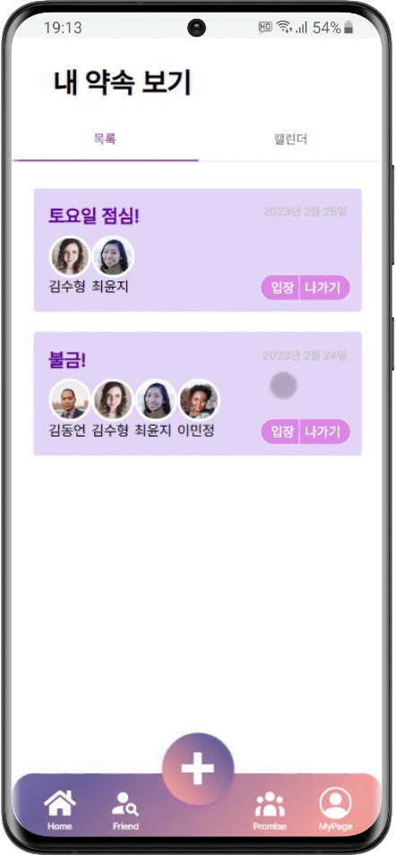
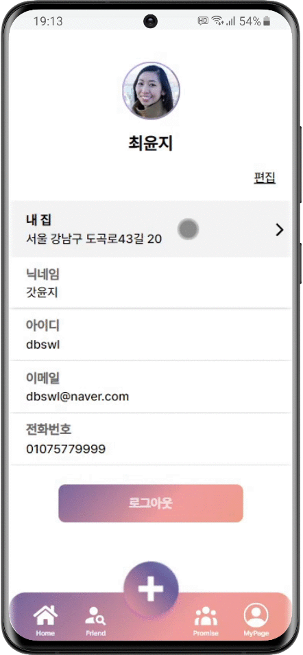

# ⛳ promiSpot - 함께 정하는 약속장소

## 📅 프로젝트 진행 기간

2023.01.09(월) ~ 2023.02.17(금) (40일간 진행)

## 🚩 promiSpot - 배경
**친구와의 약속, 연인과의 데이트, 낯선 사람들과의 모임**

우리는 끊임없이 누군가와의 만남을 약속하고, 만남을 이어나가며 살아가고 있습니다

하지만 그럴 때마다 "우리 어디서 만날까?" "내가 말한 그 식당 어때?" "그때 누가 괜찮다고 했던 거긴 어디였지?" 같은 질문이 끊임없이 되풀이되는 상황, 한 번쯤 다들 겪어보지 않았을까요?

약속을 정할 때마다 지겹게 되풀이되는 우리 그래서 도대체 어디서 만나? 라는 의문, 저희가 해결해드리겠습니다

모두가 함께 저마다 저마다의 장소들을 추천할 수 있습니다!

추천된 장소들에는 각각의 사용자들이 투표를 할 수 있어 투표의 결과로 각 장소의 순위도 알 수 있습니다!

더 이상 한 명이 혼자 약속 장소를 정해야 하는 고민을 떠안을 필요 없습니다!

모두가 함께 정하는 약속장소, 프로미스팟과 함께라면 가능합니다!

## 🚩 promiSpot - 개요
함께,

만드는,

약속장소,

프로미스팟입니다

프로미스팟(promiSpot)은 약속의 promise와 장소의 spot을 합친 말로 친구 또는 지인들과의 만남을 약속하게 될 때 만날 장소와 일정을 좀 더 편리하게 도와주는 모바일 웹 서비스입니다.

언제 어디서나 약속을 잡는 것이 편리할 수 있도록 모바일 페이지에서 제작되었고, 지도 API와 웹 소켓을 통해 동시에 실시간으로 통신이 가능하도록 하여 다수의 사용자들 간에도 편리하게 이용할 수 있게 하였습니다. 

## ✨ 주요 기능

- ### 📱 친구 신청
	- 닉네임으로 친구를 검색하고 친구 요청을 보낼 수 있습니다.
	- 친구가 요청을 수락하면, 이제 함께 약속을 잡으러 가볼까요?
- ### 🎯 약속 생성
	- 함께 만날 친구들을 선택하고, 일정 제목, 날짜 등을 지정하여 새로운 약속을 생성할 수 있습니다.
	- 친구가 생성한 약속은, 약속 페이지에서 확인하고 입장해 보세요!
- ### 🌇 장소 검색
	- 현재 보고 있는 지도의 범위 내에 있는 장소를 키워드로 검색할 수 있습니다.
	- 장소 이름을 클릭하여 상세 정보를 확인하고, 후보지로 등록해 보세요!
- ### 🌆 장소 추천
	- 관광명소, 음식점, 카페, 문화시설 별로 총 4가지의 장소가 랜덤으로 추천되어 나타납니다.
	- 특정 위치의 장소를 추천받고 싶다면 지도를 움직여 보세요!
- ### 🗳 후보지 투표
	- 약속에 참여한 인원들이 등록한 후보지를 지도에서 확인할 수 있습니다.
	- 실시간 투표 현황 버튼을 클릭하여 각 후보지가 몇 표를 받았는지 또한 확인 가능합니다.
	- 마커를 클릭하여 위치, 별점 등의 상세 정보를 확인하고, 마음에 드는 곳에 투표해 보세요!
- ### 💬 채팅
	- 약속에 참여한 인원들과 함께 채팅할 수 있습니다.
	- 채팅 기능을 활용하여 실시간으로 소통하며 약속 장소를 정해보세요!

## 💫 개발환경 & 주요 기술

### Backend

- Java : 11
- SpringBoot : 2.7.8
- websocket, sockjs, stomp
- mybatis 2.1.1

### DataBase

- MySQL : 8.0.31
- MongoDB  : 4.4.18

### Frontend

- React 18.2.0
- Axios 1.2.4
- Redux 8.0.5
- Router Dom 6.7.0
- Material UI v5.11.6
- Sock.js-client - 1.6.1

### CI/CD

- Jenkins
- Docker
- NGINX
- CertBot

### Server:AWS EC2

- OS: Ubuntu 20.04 LTS (GNU/Linux 5.4.0-1018aws x86_64)

### IDE

- Visual Studio Code IDE
- HeidiSQL
- WorkBench
- InteliJ
- MogoDBCompass
- Figma

## ✔ 협업 툴

- Git
- Notion
- JIRA
- MatterMost
- Webex

## 👨‍💻 팀원

| 이름   | GitHub                                         | 개발  | 역할                                  |
| ------ | ---------------------------------------------- | ------- | -------------------------------------|
| 김동언 |  | BE | <h3><b>😁 팀장 & 백엔드 팀장</b></h3><ul><li>Websocket(STOMP 방식) 활용해 실시간 기능 구현    (채팅, 출발지 설정, 약속 장소 등록, 중간 지점 추천)</li><li> 지도 기능 구현 (투표 기능, 투표 현황)</li><li> API 작성 (출발지, 약속 장소, 투표 등)</li><li> 프론트와 백단 API 적용 (Axios 활용)</li><li> 화면 구성 (React Redux, UseEffect 사용)</li><li> 채팅  NoSQL(MongoDB) 사용</li><li> 출발지, 약속 장소, 투표 내용 등 RDBMS(MySQL)에 저장</li></ul> |
| 김수형 |  | FE | <h3><b>😇 프론트엔드 팀장</b></h3><ul><li> 와이어프레임 설계(Figma)</li><li> Redux 관리</li><li> 카카오 지도 API 연동을 통한 지도 페이지 구현 & 장소 검색 & 장소 추천</li><li> 프론트  API 작성</li><li> React Component 설계 및 관리</li></ul> |
| 이민정 |  | BE | <h3><b>😜 CI/CD 팀장</b></h3><ul><li> 서버 담당</li><li> API 설계 및 유지보수</li><li> Docker, Jenkins를 활용해 AWS 배포</li><li> JWT 로그인 구현</li><li> 회원, 친구 기능 담당</li></ul> |
| 최윤지 |  | FE | <h3><b>😆 디자인 팀장</b></h3><ul><li> UI/UX 설계</li><li> 와이어프레임 설계(Figma)</li><li> 사용자 관점에서의 시나리오 및 플로우 정의</li><li> Component와 Page 구성 및 관리</li><li> React & Redux 작성 및 관리</li>/ul>|

Thanks to : 최희경, 정유현

## 🌟 promiSpot 서비스 화면

### 💡 시작 페이지

- ‘함께 정하는 약속장소’라는 슬로건 문구, promiSpot 로고, 로그인, 회원가입 버튼으로 구성되어 있습니다.

- 배경으로 나오는 낮과 밤의 전환은, 친구들과 낮부터 밤까지 함께하는 약속에 저희 서비스를 유용하게 사용할 수 있음을 표현하였습니다.

### 💡 회원가입

- 아이디, 이메일, 비밀번호, 이름, 닉네임, 전화번호와 주소를 입력받게 됩니다.

- 주소 입력창을 선택하면 주소 검색 페이지로 이동하게 됩니다.

  - 내 주소를 검색한 후 선택하면 다시 회원가입 페이지로 이동합니다.

 &nbsp; 

### 💡 로그인

- 아이디와 비밀번호를 입력한 후 로그인 버튼을 누르면 메인 페이지로 이동합니다.

- 가입한 회원이 아니거나 아이디, 비밀번호가 틀리다면 로그인을 할 수 없습니다.

### 💡 메인 페이지

- 현재 참여 중인 약속들을 Sliding 형태로 볼 수 있습니다.

- 약속 날짜, 제목, 참여인원, 각 장소별 투표 현황을 확인할 수 있습니다.

- 아래에 있는 TabBar에서는 Home(메인 페이지), Friend(친구 페이지), `+`(새로운 약속 생성), Promise(약속 페이지), MyPage(마이 페이지) 버튼으로 각 페이지로 이동할 수 있습니다.

### 💡 친구 페이지

- 내 친구 Tab에서는 친구들 목록을 볼 수 있습니다.

  - 친구들의 프로필 이미지, 닉네임, 아이디를 보여줍니다.

- 받은 요청 Tab에서는 내게 온 친구 요청을 목록으로 볼 수 있습니다.

  - 각 요청마다 수락/거절 버튼이 있습니다.
  
  - 수락을 하면 친구가 되어 친구 목록에서 확인 가능하고, 거절을 누르면 받은 요청에서 사라지게 됩니다.

- 보낸 요청 Tab에서는 내가 요청한 목록을 볼 수 있습니다.
  
  - 요청 취소 버튼을 누르면 요청이 취소됩니다.

- 검색창에서는 아이디 또는 전화번호로 친구 검색을 할 수 있습니다.
  
  - 요청 버튼을 눌러 친구 요청이 가능하고, 요청을 누르면 보낸 요청 Tab에서 확인 가능합니다.
  
  - 이미 요청된 친구라면 요청 취소 버튼으로 표시됩니다.
    

### 💡 약속 페이지

- 내가 참여한 약속들을 목록형과 캘린더형으로 나누어 볼 수 있습니다.

- 목록형에서는 내가 참여한 약속들이 카드 형태로 나타나게 됩니다.

  - 각각의 카드에는 약속의 제목, 날짜, 참여자와 입장/나가기기 버튼이 존재합니다.

- 캘린더형에서는 참여한 약속이 있는 날짜 아래에 빨간 점으로 표시가 되어 있습니다.

### 💡 마이 페이지

- 프로필 사진, 이름, 주소, 닉네임, 이메일, 전화번호 등의 정보를 확인할 수 있습니다.

- 편집 버튼을 누르면 닉네임을 수정할 수 있습니다.

- 주소의 경우 현재 기본 주소로 설정된 주소가 보입니다.

  - 주소 별칭과, 기본 주소 설정 여부를 수정할 수 있습니다.

  - 새로운 주소를 기본 주소로 설정할 경우, 기존의 기본 주소는 해제되어 일반 주소로 변환됩니다.
  
  - 기본 주소는 삭제할 수 없습니다.

- 로그아웃 버튼을 클릭하면, 로그아웃 상태가 되고 로그인 화면으로 이동합니다.

### 💡 약속 생성 페이지

- TabBar의 `+`을 통해 생성할 수 있습니다.

- 나와 친구를 맺은 친구들의 목록이 뜨게 되고, 그중 함께 약속에 참여할 친구들을 선택할 수 있습니다.

- 약속의 제목과 날짜를 정한 후 약속을 생성하게 되면 약속 생성 페이지(지도)로 이동하게 됩니다.

### 💡 출발지 설정

- 지도 페이지에서 자신의 출발지를 두 가지 방법으로 선택할 수 있습니다.

- 등록되어 있는 주소에서 선택 : 등록되어 있는 주소들의 목록을 선택하면 출발지로 설정됩니다.

- 직접 선택 : 좌측 상단에 출발지 선택을 누른 후 지도에서 선택하면 출발지로 설정됩니다.

### 💡 장소 검색

- 현재 보고 있는 지도 범위 내에서 장소를 검색할 수 있습니다.

- 지도의 반경이 변경 됨에 따라 검색 결과도 변경됩니다.

- 장소 상세 정보 페이지로 이동할 수 있게 됩니다.

  - 장소의 카테고리, 주소, 이미지, 별점 등을 볼 수 있습니다.

- 검색 결과 화면에는 스크롤 기능이 적용되어 있습니다.

### 💡 장소 등록

- 장소 상세 페이지의 장소 등록 버튼을 통해 약속 장소 후보에 등록할 수 있습니다.

- 약속 장소 후보로 등록되면 지도에 노란색 마커로 표시됩니다.

- 지도의 노란색 마커를 선택하면 약속 장소 후보의 상세 페이지로 이동됩니다.

- 내가 등록한 장소를 다른 유저들도 실시간으로 반영됩니다.

 &nbsp; 

### 💡 장소 추천

- 현재 보고 있는 지도의 중심 위치를 기준으로 반경 거리를 계산하여 장소를 추천합니다.

- 카테고리(관광명소, 음식점, 카페, 문화시설) 별로 총 4가지의 장소가 랜덤으로 추천되어 나타납니다.

- 지도의 중심 위치가 변경 됨에 따라 추천되는 장소도 변경됩니다.

- 랜덤으로 추천되기 때문에 지도의 중심 위치가 변경되지 않아도 추천되는 결과는 변경될 수 있습니다.

 &nbsp; 

### 💡 채팅

- 지도에 들어온 사용자들끼리 의사소통을 위해 채팅을 사용할 수 있습니다.

- DB에 채팅 내역을 저장하기 때문에 창이 꺼지거나 중간에 들어와도 채팅 내역을 볼 수 있습니다.

### 💡 투표

- 등록 장소 후보에 투표 버튼을 통해 투표를 할 수 있습니다.

- 채팅 현황 게시판을 통해 현재의 투표 상황을 파악할 수 있습니다.

